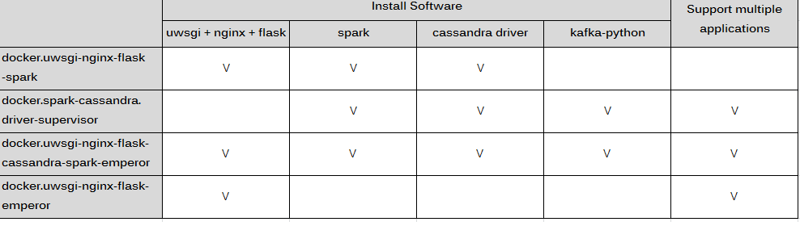

# docker.uwsgi-nginx-flask-cassandra-spark-emperor #
This docker image allow to handle multiple flask applications at the same time, and we also installed following software as below.

- spark
- cassandra connector
- uwsgi
- flask
- nginx

## Comparison between my repository ##

To find the fittest repository by the following image.

Go to [cutejaneii/docker.uwsgi-nginx-flask-spark](https://github.com/cutejaneii/docker.uwsgi-nginx-flask-spark)

Go to [cutejaneii/docker.spark-cassandra.driver-supervisor](https://github.com/cutejaneii/docker.spark-cassandra.-driver-supervisor)

Go to [cutejaneii/docker.uwsgi-nginx-flask-cassandra-spark-emperor](https://github.com/cutejaneii/docker.uwsgi-nginx-flask-cassandra-spark-emperor)

Go to [cutejaneii/docker.uwsgi-nginx-flask-emperor](https://github.com/cutejaneii/docker.uwsgi-nginx-flask-emperor)

## What this project do ? ##

To make multiple flask applications run at the same time, we modify nginx.conf and uwsgi config, and use emperor mode to monitor the folder (/etc/uwsgi/vassals) if any .ini files add/delete/modified.

## What is the difference between this project and [docker.uwsgi-nginx-flask-emperor project](https://github.com/cutejaneii/docker.uwsgi-nginx-flask-emperor) ? ##

[docker.uwsgi-nginx-flask-emperor project](https://github.com/cutejaneii/docker.uwsgi-nginx-flask-emperor) is a simple project allows basic flask applications run, but if you have to use spark/cassandra, you can use this project directly since we've already installed the software you need into the image, AND, you can always modify the Dockerfile as your needs.

## Usage ##

To run it if you DO NOT need to volumn folder:

> docker run -d -p 9090:80 --name uwsgi-nginx-flask-cassandra-spark-emperor cutejaneii/docker.uwsgi-nginx-flask-spark-cassandra-emperor

To run it if you NEED your docker container work with data volumes:

> docker run -d -p 9090:80 --name nginx-uwsgi-emperor 
> -v /{host_folder}/nginx.conf:/etc/nginx/conf.d/nginx.conf 
> -v /{host_folder}/app:/app 
> -v /{host_folder}/vassals:/etc/uwsgi/vassals 
> cutejaneii/docker.uwsgi-nginx-flask-cassandra-spark-emperor

## How to test ? ##

Open following urls from browser:

http://yourIP:9090/test/ -- You will see the cotent: Hello, this is test 1~

http://yourIP:9090/test2/ -- You will see the cotent: Hello, this is test 2~

## How to deploy your flask application ? ##

- Create a subfolder and put it into /app folder.
- Put your python files into subfolder which you created.
- Add .ini file for your application and put it into /vassals folder
- Edit nginx.conf

Remeber to RESTART YOUR CONTAINER!
